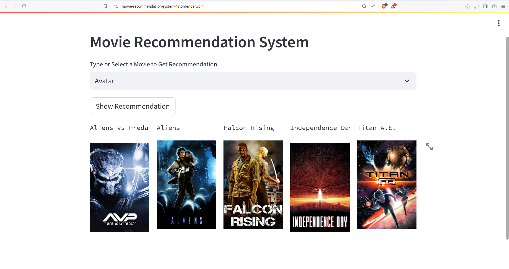
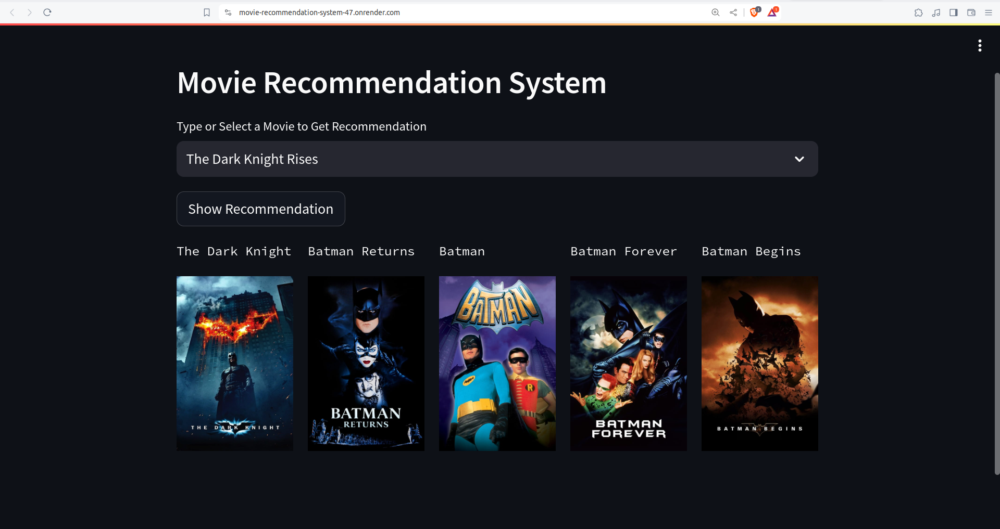

# Movie Recommendation System

## About this project
This is a Streamlit web application for a ```Content Based``` Movie Recommendation System.

[Click here to run it](https://movie-recommendation-system-47.onrender.com/)

## Demo



## Dataset Used
The dataset used in this project can be found [here](https://www.kaggle.com/datasets/tmdb/tmdb-movie-metadata).

## How to Run
### Steps:
1. Clone the repository:
   ```bash
   https://github.com/Shimul-Baidya/Movie-Recommendation-System.git
2. Install the requirements:
   ```bash
   pip install -r requirements.txt
3. Run the following notebook to generate the models:
   
   `Movie_Recommendation_System.ipynb`
4. Run the Streamlit app:
   ```bash
   streamlit run app.py